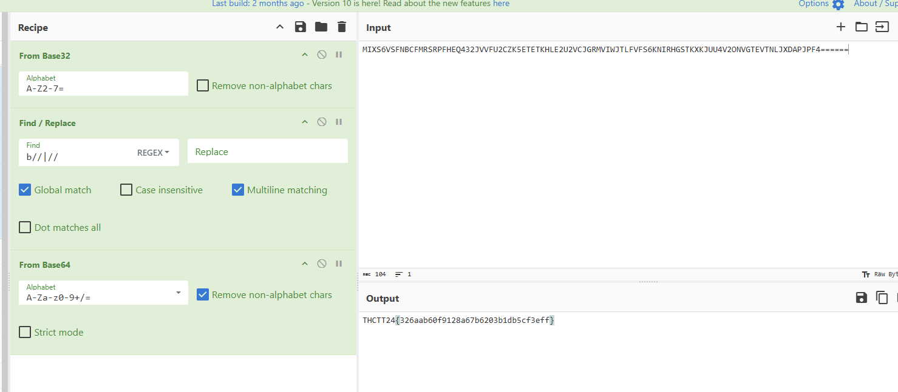

# Cryptography - Easy1

เปิดไฟล์ดูได้ข้อความอะไรบ้างอย่าง `MIXS6VSFNBCFMRSRPFHEQ432JVVFU2CZK5ETETKHLE2U2VCJGRMVIWJTLFVFS6KNIRHGSTKXKJUU4V2ONVGTEVTNLJXDAPJPF4======` ลากใส่ cyberchef โลด แปลงจาก base32 ลบ prefix(`b//`) กับ suffix(`//`) แล้วแปลจาก base64 อีกรอบ

ได้มาแล้วว THCTT24{326aab60f9128a67b6203b1db5cf3eff}

[Index](../)
