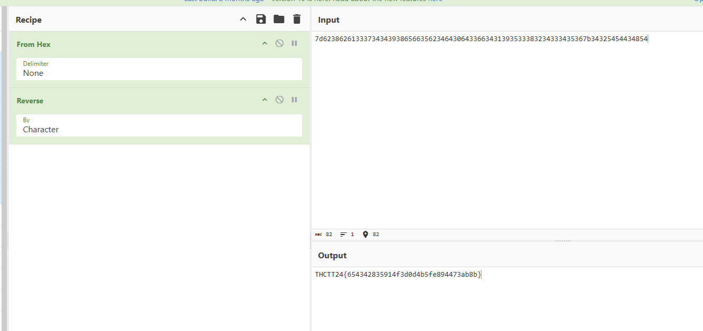

# Cryptography - Easy2

เปิดไฟล์มาได้ข้อความ `7d62386261333734343938656635623464306433663431393533383234333435367b34325454434854` ยัดใส่ cyberchef แปลค่าจาก hex ได้ `}b8ba374498ef5b4d0d3f419538243456{42TTCHT` ทรงเหมือน reverse ก็ลอง reverse ย้อนดู

ได้มาแล้ว THCTT24{654342835914f3d0d4b5fe894473ab8b}

[Index](../)
