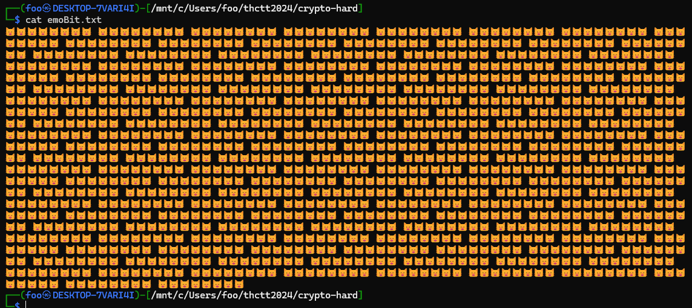
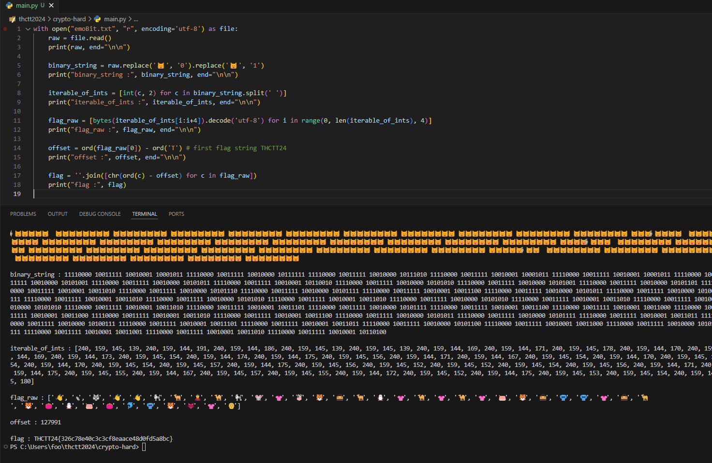

# Cryptography - Hard

อิหยังอีกน่อ

เช็คตัวซ้ำกันสักหน่อย `cat emoBit.txt | sed 's/\(.\)/\1\n/g' | sort -u` เดาว่า ตายิ้มคือ 0 ตาเปิดคือ 1

1. อ่านไฟล์ `emoBit.txt`
2. แปลงตาเป็น ตายิ้มคือ 0 ตาเปิดคือ 1
3. แปลงให้ binary แมว เป็นตัวเลข เพื่อเอาไว้ทำ utf-8 decode 4 bytes
4. แปลงตัวเลขทีละ 4 ตัว เป็น utf-8 string
5. อนุมานว่า 👋 คือ T เพราะเข้า pattern THCTT24 (👋🐿🐺👋👋🐩🐫)
6. หา offset จาก T ไป 👋
7. ลบ offset ออกจาก utf-8 string ของแต่ละ character

ได้มาแล้ว THCTT24{326c78e40c3c3cf8eaace48d0fd5a8bc}

[Index](../)
