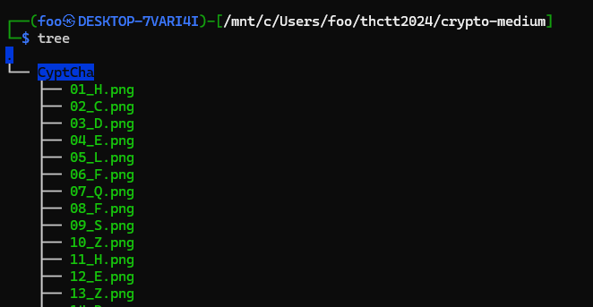
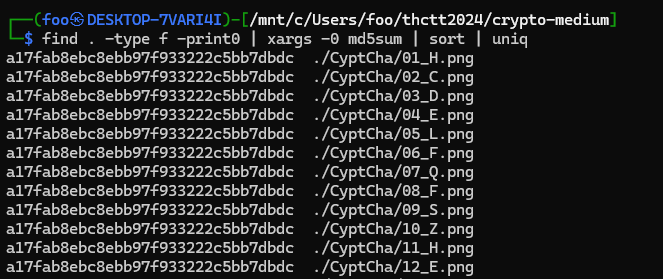
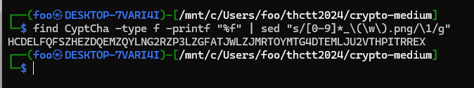
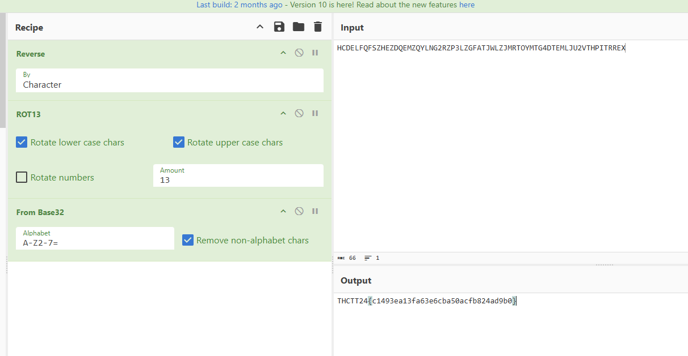

# Cryptography - Medium

tree ดูก็จะพบไฟล์มหาศาล

ลอง checksum ดู เอ๊าเหมือนกันหมด แต่สังเกตุที่ชื่อไฟล์มันมีความต่าง

ขอรับชื่อไฟล์หน่อยแล้วกัน `find CyptCha -type f -printf "%f" | sed "s/[0-9]*_\(\w\).png/\1/g"`

- 1 `HCDELFQFSZHEZDQEMZQYLNG2RZP3LZGFATJWLZJMRTOYMTG4DTEMLJU2VTHPITRREX` สังเกตุที่ตัวท้ายๆ XERRTIPH จบด้วย H ; flag บ่นิ
- 2 `XERRTIPHTV2UJLMETD4GTMYOTRMJZLWJTAFGZL3PZR2GNLYQZMEQDZEHZSFQFLEDCH` reverse แล้วไงต่อ ลอง rot13 ดู
- 3 `KREEGVCUGI2HWYZRGQ4TGZLBGEZWMYJWGNSTMY3CME2TAYLDMZRDQMRUMFSDSYRQPU` ยังไงต่อ มีให้เลือก base32 กับ base64 ลองเลือก base32 เพราะไม่มี = กับเลขอยู่ในช่วง 0-7

ได้มาแล้ว THCTT24{c1493ea13fa63e6cba50acfb824ad9b0}

[Index](../)
