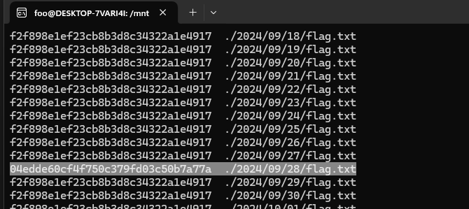

# Digital Forensic - Easy1

เปิด tree มาเจอไฟล์มหาศาล

ใช้ checksum ช่วยหาไฟล์ไม่เหมือนชาวบ้านเขา `find . -type f -print0 | xargs -0 md5sum` แล้วก็เจอตอ

cat ดูดิ

ได้มาแล้ว THCTT24{853cc79bcd99fd4b9688032b487c0724}

[Index](../)
