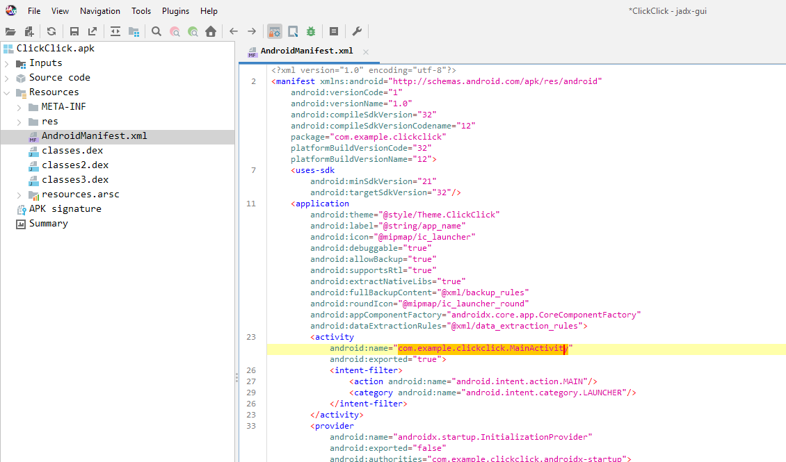
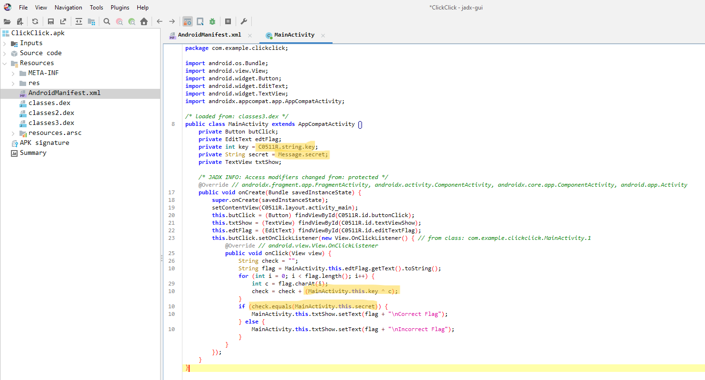
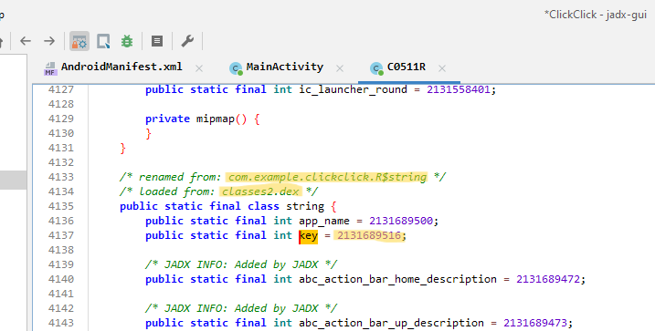
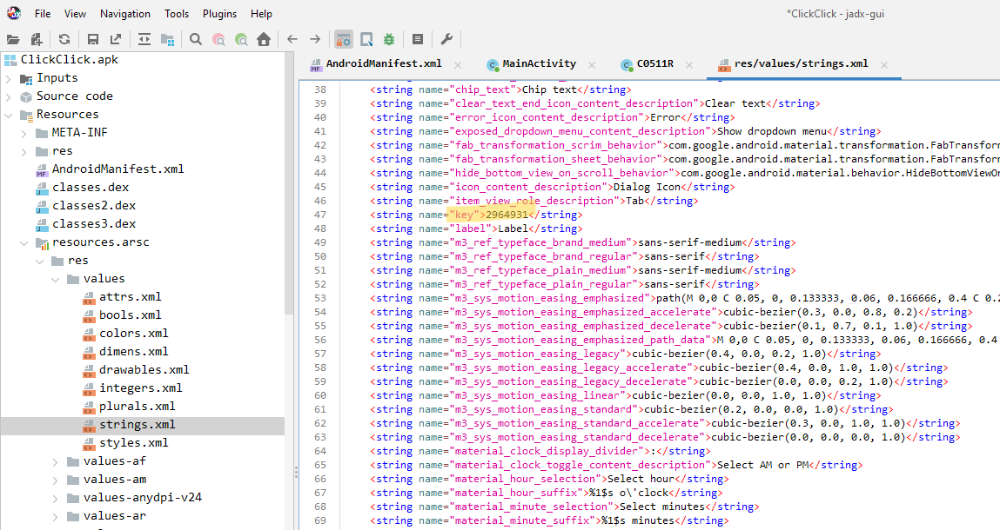
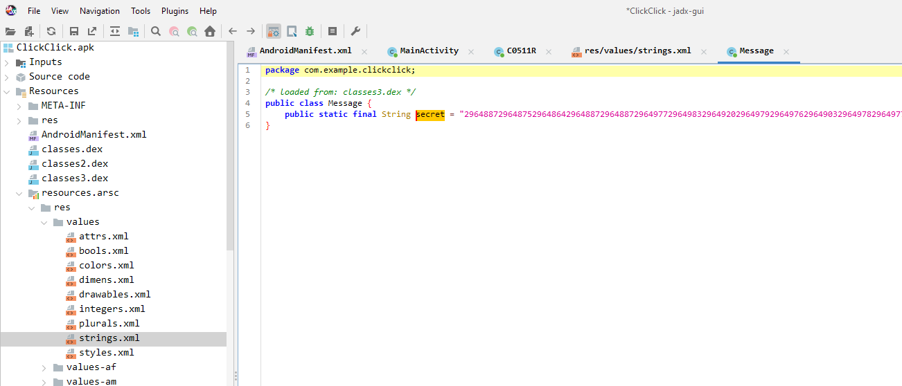
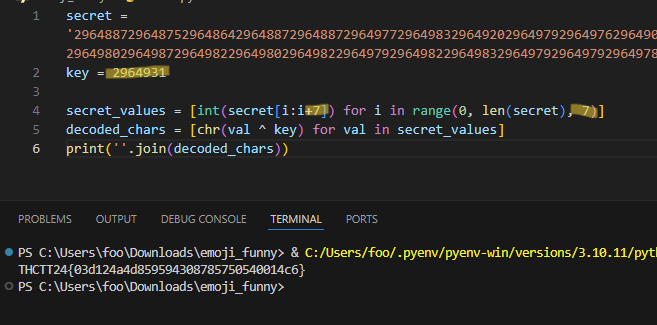

# Mobile Security - Click Click

manifest ไม่มีอะไร ก็ไปดูกันต่อ

โอเค มันคือ xor cipher สินะ , มี key กับ secret (ตรวจคำตอบ) ตามไปดูว่ามีข้อมูลอะไร

ทรงนี้คือไม่ใช่ value เด้อ มันอารมณ์ address สำหรับ i18n

อันนี้อารมณ์สมุดคำ ข้างบนเป็น R$string เราเลยมาหาที่ strings อะ เจอ key แล้ว 2964931

แวะมาดู secret อุววว อย่างยาว 29648872964875296486429648872964887296497729649832964920296497929649762964903296497829649772964983296489829649832964903296498729649822964986296498229649862964983296497629649792964987296498029649872964982296498029649822964979296498229649832964979296497929649782964983296489629649812964926

แล้วเราก็ทำการแก้ xor โดยที่จะแบ่งคำออกทีละ 7 ตัว ตามความยาว key ได้มาแว้ว THCTT24{03d124a4d859594308785750540014c6}

[Index](../)
