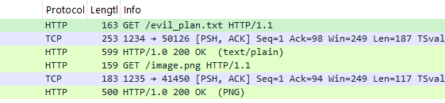
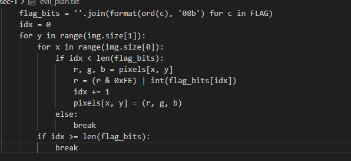
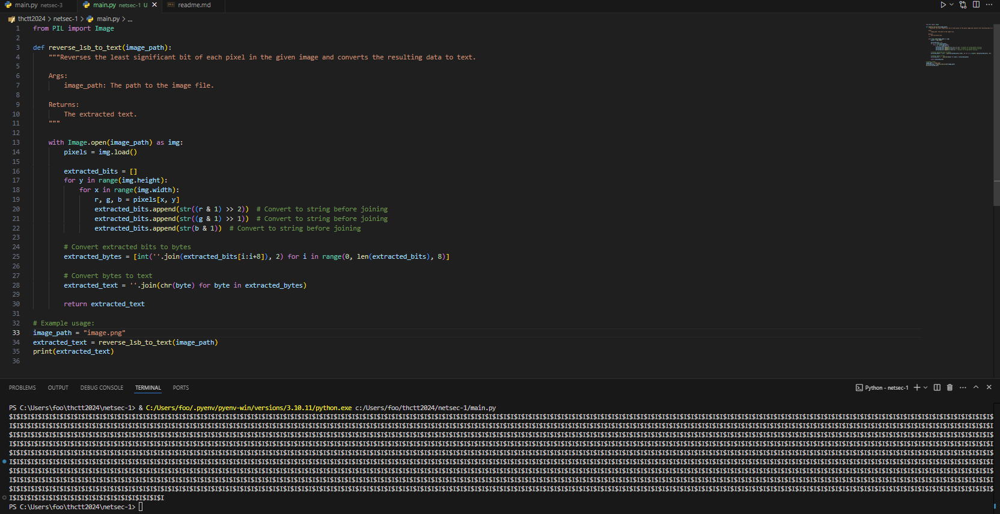
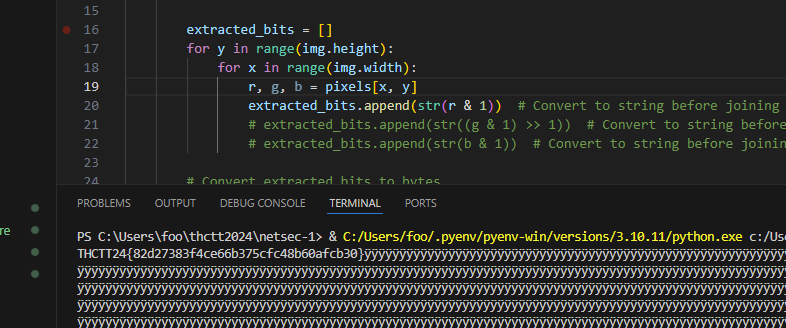

# Network Security - HTTP Mayhem

มี http ขอสองไฟล์ ก็ export object -> http ออกมาให้หมด

พอไปแปะใน llm มันบอกว่า `ฝัง flag ลงในภาพโดยการปรับบิตที่มีนัยสำคัญน้อยที่สุด (the least significant bit : LSB) ของแต่ละพิกเซล` งั้นลองให้มันเขียน reverse lsb ออกมา

พอรันดูก็จะเห็นว่า flag ไม่ออก

งั้นลองไล่ดูทีละสีดิ

ได้มาแล้วว THCTT24{82d27383f4ce66b375cfc48b60afcb30}

[Index](../)
