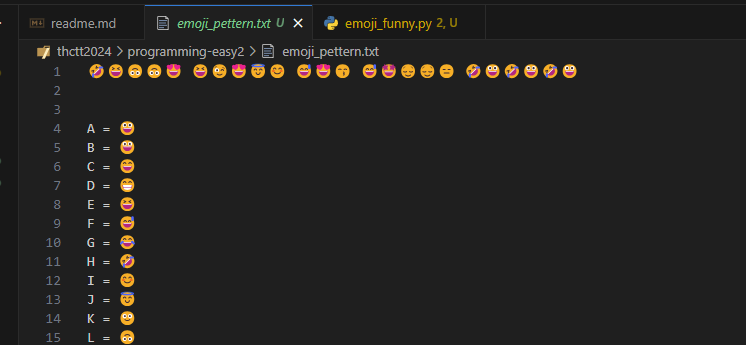
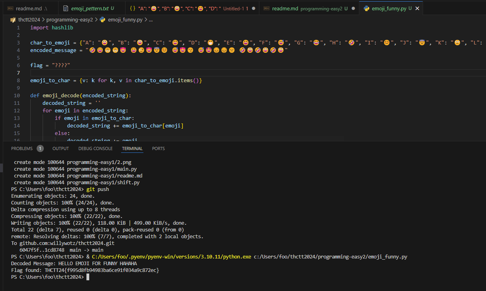

# Programming - Easy2

จากไฟล์ emoji_pattern มันคงให้เราทำ map เริ่มด้วยการสร้าง map dict ง่ายๆ ด้วย sed ใน vscode `s/^(.) = (.)\n?/"$1": "$2", /g`

แล้วทำไฟล์ python ให้เรียบร้อย

ได้มาแล้ว THCTT24{f995d8fb94983ba6ce91f034a9c872ec}

[Index](../)
